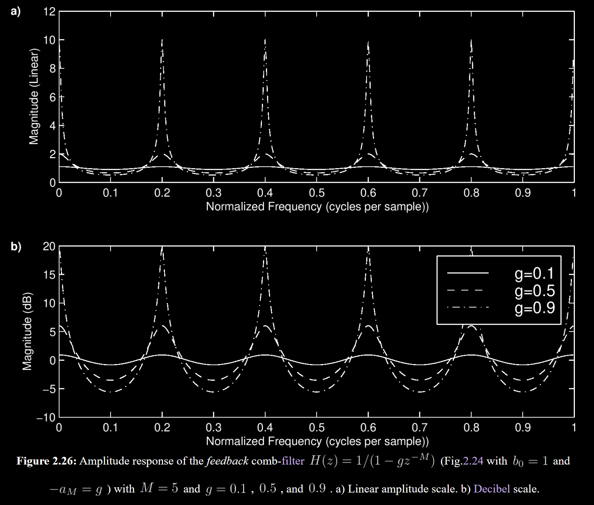

To a good first approximation, wave energy is *conserved* as it [propagates](http://ccrma.stanford.edu/realsimple/travelingwaves) through the air. In a spherical [pressure wave](https://scienceworld.wolfram.com/physics/PressureWave.html) of radius  , the energy of the wavefront is spread out over the spherical surface area  . Therefore, the energy per unit area of an expanding spherical [pressure](http://en.wikipedia.org/wiki/Pressure) wave decreases as  . This is called *spherical spreading loss*. It is also an example of an *[inverse square law](https://scienceworld.wolfram.com/physics/InverseSquareLaw.html)* which is found repeatedly in the [physics](https://scienceworld.wolfram.com/physics/) of conserved quantities in three-dimensional space. Since energy is proportional to amplitude squared, an inverse square law for energy translates to a  decay law for amplitude.

```c++
/* delayline.c */
    static double D[M];           // initialized to zero
    static long ptr=0;            // read-write offset

    double delayline(double x)
    {
      double y = D[ptr];          // read operation 
      D[ptr++] = x;               // write operation
      if (ptr >= M) { ptr -= M; } // wrap ptr if needed
//    ptr %= M;                   // modulo-operator syntax
      return y;
    }
这段代码是什么含义
```


```c++
/* Acoustic echo simulator, main C++ program.
   Compatible with STK version 4.2.1.
   Usage: main inputsoundfile 
   Writes main.wav as output soundfile
 */

#include "FileWvIn.h"  /* STK soundfile input support */
#include "FileWvOut.h" /* STK soundfile output support */

static const int M = 20000; /* echo delay in samples */
static const int g = 0.8;   /* relative gain factor */

#include "delayline.c" /* defined previously */

int main(int argc, char *argv[]) 
{ 
  long i;
  Stk::setSampleRate(FileRead(argv[1]).fileRate());
  FileWvIn input(argv[1]);  /* read input soundfile */
  FileWvOut output("main"); /* creates main.wav */
  long nsamps = input.getSize();
  for (i=0;i<nsamps+M;i++)   {
    StkFloat insamp = input.tick();
    output.tick(insamp + g * delayline(insamp));
  }
}
```

where  denotes the *filtering per sample* in the [propagation](http://ccrma.stanford.edu/realsimple/travelingwaves) medium. Since air absorption cannot amplify a [wave](https://en.wikipedia.org/wiki/Wave) at any frequency, we have  . A lossy [delay line](https://ccrma.stanford.edu/~jos/pasp/Delay_Lines.html) for [plane-wave](https://scienceworld.wolfram.com/physics/PlaneWave.html) simulation is thus described by


in the [frequency domain](https://ccrma.stanford.edu/~jos/mdft/), and


in the time domain, where ` ' denotes [convolution](https://ccrma.stanford.edu/~jos/mdft/Convolution.html), and  is the [impulse response](https://ccrma.stanford.edu/~jos/filters/Impulse_Response_Representation.html) of the per-sample loss filter  . The effect of  on the [poles](https://ccrma.stanford.edu/~jos/filters/Pole_Zero_Analysis_I.html) of the system is discussed in §[3.7.4](https://ccrma.stanford.edu/~jos/pasp/Achieving_Desired_Reverberation_Times.html#sec:revtime).

For spherical waves, the loss due to spherical spreading is of the form


where  is the distance from  to  . We see that the spherical spreading [loss factor](https://www.researchgate.net/publication/259597207_The_Loss_Factor_as_a_Measure_of_Mechanical_Damping) is ``hyperbolic'' in the propagation distance  , while air absorption is [exponential](https://ccrma.stanford.edu/~jos/mdft/Exponentials.html) in  .

## Tapped [Delay Line](https://ccrma.stanford.edu/~jos/pasp/Delay_Lines.html) (TDL)

A *tapped [delay line](http://ccrma.stanford.edu/realsimple/Delay/Delay_lines.html)* (TDL) is a delay line with at least one ``tap''. A delay-line *tap* extracts a [signal](http://ccrma.stanford.edu/~jos/filters/Definition_Signal.html) output from somewhere within the delay line, optionally scales it, and typically sums with other taps to form a TDL output signal. A tap may be *interpolating* or *non-interpolating*. A non-interpolating tap extracts the signal at some fixed integer delay relative to the input. Thus, a tap implements a shorter delay line within a larger one, as shown in Fig.[2.18](https://ccrma.stanford.edu/~jos/pasp/Tapped_Delay_Line_TDL.html#fig:tdlsimp).


Tapped delay lines efficiently simulate *multiple echoes* from the same source signal. As a result, they are extensively used in the field of *[artificial reverberation](https://ccrma.stanford.edu/~jos/pasp/Artificial_Reverberation.html)*.


## Comb Filter




## TDL Reverberation

the only limitations of a tapped delay line are (1) it is *expensive* computationally relative to other techniques, (2) it handles only one ``point to point'' [transfer function](https://ccrma.stanford.edu/~jos/filters/Transfer_Function_Analysis.html), *i.e.*, from one point-source to one ear,[4.1](https://ccrma.stanford.edu/~jos/pasp/footnode.html#foot13945) and (3) it should be changed when the source, listener, or anything in the room moves.


While a [tapped delay line](https://ccrma.stanford.edu/~jos/pasp/Tapped_Delay_Line_TDL.html) [FIR filter](https://ccrma.stanford.edu/~jos/filters/FIR_Digital_Filters.html) can provide an accurate model for any point-to-point transfer function in a reverberant environment, it is rarely used for this purpose in practice because of the extremely high computational expense.


## EDR


### the early reflection

The ``early reflections'' portion of the [impulse response](https://ccrma.stanford.edu/~jos/filters/Impulse_Response_Representation.html) of a reverberant environment is often taken to be the first 100ms or so [[317](https://ccrma.stanford.edu/~jos/pasp/Bibliography.html#MoorerReverb79)]. However, for greater accuracy, it should be extended to the time at which the [reverberation](https://ccrma.stanford.edu/~jos/pasp/Artificial_Reverberation.html) reaches its asymptotic statistical behavior.[4.5](https://ccrma.stanford.edu/~jos/pasp/footnode.html#foot14332)


### the late reverberation

From a perceptual standpoint, the main qualities desired of a good late-reverberation [impulse response](https://ccrma.stanford.edu/~jos/filters/Impulse_Response_Representation.html) are

1. a smooth (but not too smooth) decay, and
2. a smooth (but not too regular) [frequency response](https://ccrma.stanford.edu/~jos/filters/Frequency_Response_I.html).

## Schroeder Allpass Sections


